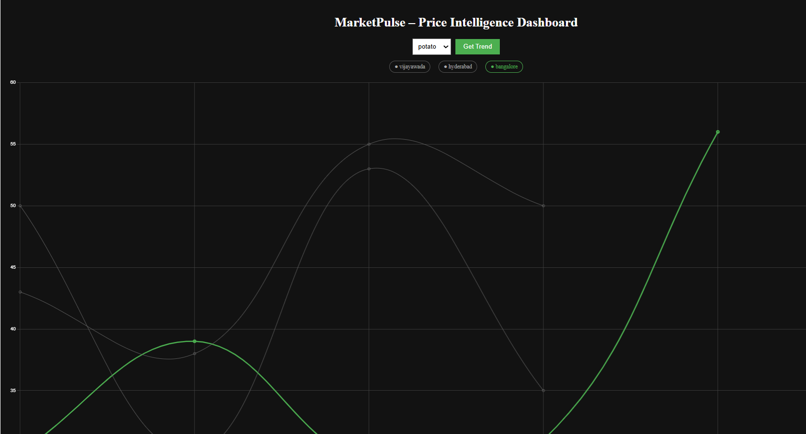

# MarketPulse – Price Intelligence Dashboard

A full-stack data analytics application that tracks and visualizes commodity price trends across multiple cities with interactive dashboards.

---

## 🚀 Live Demo

- 🌐 **Frontend**  
  https://price-tracker-9wzjfw3gb-neerajtirumalasettys-projects.vercel.app

- ⚙️ **Backend API**  
  https://price-tracker-backend-eldi.onrender.com

---

## 📌 Features

- 📊 Multi-city price comparison (Vijayawada, Hyderabad, Bangalore)
- 📈 Time-series trend visualization using interactive charts
- ⚡ FastAPI backend serving REST APIs
- 🔍 Dynamic filtering by item (tomato, onion, potato)
- 🎯 Highlight-based city comparison for better analysis
- 🌐 Fully deployed (Frontend + Backend)

---

## 🛠️ Tech Stack

**Frontend**
- React.js
- Chart.js
- Axios

**Backend**
- FastAPI
- Pandas

**Deployment**
- Vercel (Frontend)
- Render (Backend)

---

## ⚙️ How It Works

1. Data is generated and stored using Python scripts  
2. Cleaned using Pandas for consistency  
3. FastAPI exposes REST endpoints  
4. React frontend fetches and visualizes data  
5. Users interactively explore trends across cities  

---

## 📸 Screenshot

---

## 💡 Future Improvements

- Price prediction using ML models  
- Date range filtering  
- Real-time data integration (APIs)  
- Advanced analytics (moving averages, anomaly detection)

---

## 👨‍💻 Author

Neeraj Tirumalasetty
